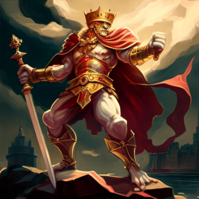
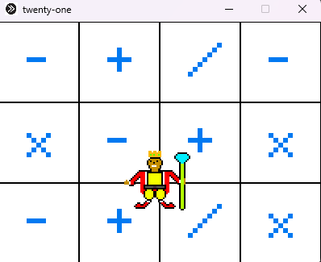

<h1 align = "center">TwentyOne</h1>

<h2> 📰About</h2>

Our game is mathematical puzzle, where you are using all your programming mathematical skills to solve troubles. The castle is in danger and you <b>gotta </b> save it.

Your mission in the game is to guess the right answer of the mathematic questions the castle gives you.

This is the only way to save the <b>kingdom!</b>

<h2> 📕Storyline</h2>

The old king's kingdom is in danger. The trolls are all over the place. It's your missionn to save the castle, only using your intelligence.

<h2> 📷Screenshots</h2>

<h2>How to run</h2>

1. Install the repository

2. Open the raylib folder, then the lib folder

3. Copy the raylib.dll file, go back to the main directory

4. Open the x64 folder, then the Debug folder and paste it there.

<h2> 🖥️Technologies </h2>
<h3> Code editors and communication services: </h3>

    
    
    
    
    

<h3> Used programming languages:</h3>

    
    

<h3> Used applications for the documentation and presentation:</h3>

    
    

<h2 align = "center">🧒 Our Team</h2>
 <a href = "https://github.com/TYAtanasov21"> Todor Atanasov </a> [Scrum trainer] 
 <a href = "https://github.com/IDDochev21"> Ivan Dochev </a> [Back-end Developer] 
 <a href = "https://github.com/AYKupenov21"> Apostol Kupenov </a> [Back-end Developer] 
 <a href = "https://github.com/TSMadzharov21"> Teodor Madjarov </a> [QA engineer] 

<h3> 
Thanks for checking out our Readme, you can help us by giving a feedback on our project!💖
<h3>
